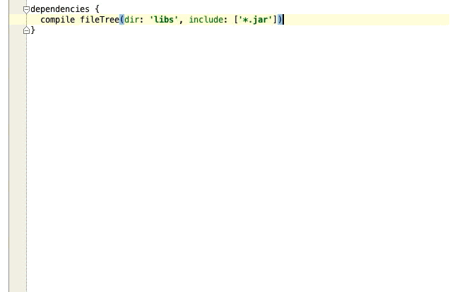

Gradle Please Workflow for Alfred 2
===================================

- Do you love [Alfred](http://www.alfredapp.com/)?
- Do you use [gradle](http://www.gradle.org/)?
- Have you used [Gradle Please](http://gradleplease.appspot.com/)?

Well if you answered yes! yes! yes! this workflow is for you!

Roadmap
=======
- Allow overrides/fuzzy search to provide better results (e.g. gcm -> play services, play services -> play-services, etc.)
- Performance improvements (local and central to use cache & async)
- TODOs
- Fix bugs
- idunnolol
